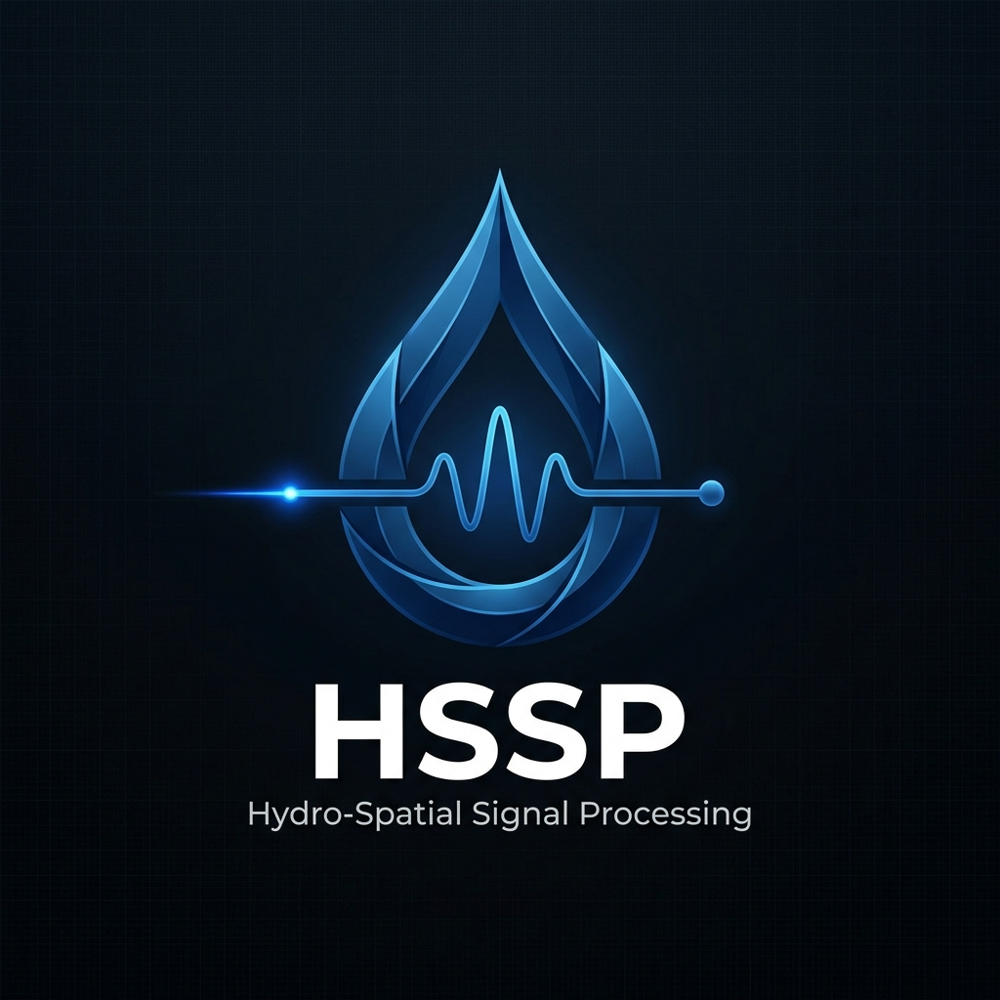

<div align="center">
  
  
  # Hydro-Spatial Signal Processing (HSSP)
  
  **Advanced 6-Axis Slosh-Filtering & Volumetric Sensing Algorithm**
  
  [](https://www.python.org/downloads/)
  [](LICENSE)
  [](#)
  [](#)

</div>

---

A self-contained Python simulation environment demonstrating a proprietary **6-axis slosh-filtering algorithm** designed for smart liquid containers. By fusing inputs from a 6-DOF IMU and a 64-zone dToF (direct Time-of-Flight) LiDAR sensor, HSSP delivers highly accurate fluid volume estimations even during extreme sloshing, turbulent motion, or rapid tilting.

<div align="center">
  
  <p><i>Real-Time Dashboard: Visualizing data gating, 8x8 LiDAR heatmaps, mathematical metrics, and volumetric cross-sections.</i></p>
</div>

---

## 🧠 Core Algorithmic Innovations

Our filtering architecture mitigates the most common noisy variables in container fluid sensing:

1. **IMU-Gating**: 
   Continuously tracks gyroscope (`deg/s`) and accelerometer (`g`) data to dynamically pause LiDAR processing during extreme kinetic events (e.g., hard shaking or >15° tilting). This ensures that violent multi-path reflections inside the container are gated out before they corrupt the liquid surface approximation.

2. **Multi-Peak Refractive Rejection**: 
   Condensation forms near the sensor in typical real-world conditions. By natively parsing the raw dToF point-cloud histograms, the filter intercepts near-field noise artifacts (e.g., droplets in the `0-5mm` range) and explicitly locks onto the true liquid surface peak, discarding anomalous near-field echoes.

3. **Refractive Intensity Correction**: 
   Utilizing the IR (infrared) photon return intensity, the system maps the distinction between reflections originating from an empty metal bottle bottom (characterized by high intensity returns) versus liquid water (lower intensity due to scattering). When water is detected, it perfectly scales the time-of-flight distance utilizing water's refractive index of `1.33`.

---

## 📂 Repository Structure

```text
HSSP_sim/
│
├── hssp.py              # The core Filter Class and mathematical algorithms
├── simulate.py          # Data generation (IMU sequences & LiDAR matrices)
├── plotter.py           # Real-time Matplotlib animation and metrics processing
├── README.md            # Project overview
├── logo.png             # Project insignia
└── hssp_demo.gif        # Exported dashboard visualizations
```

---

## 🛠️ Installation & Usage

### 1. Requirements

Ensure you are utilizing a Python version `>= 3.8`. The simulator runs dependably on standard Python scientific packages.

```bash
git clone https://github.com/k-abai/HSSP_sim.git
cd HSSP_sim
pip install numpy matplotlib pillow
```

### 2. Running the Simulator

To initialize the algorithmic pipeline, simulate a dataset, and subsequently launch the mathematical dashboard:

```bash
python plotter.py
```

The script will:
- Execute `simulate.py` to create 10 seconds of mock sensor readings.
- Pass the arrays through the logic in `hssp.py`.
- Output the fully processed layout via `matplotlib` into an animated window.
- Persist the playback locally as `hssp_demo.gif`.

---

## 🤝 Contribution Guidelines
This repository acts primarily as an algorithm demonstration sandbox. If utilizing this filter configuration in extended architectures, feel free to submit issues or adapt the algorithms for diverse IMU/LiDAR hardware bridges.

<div align="center">
  <sub>Built for volumetric edge-computing.</sub>
</div>
