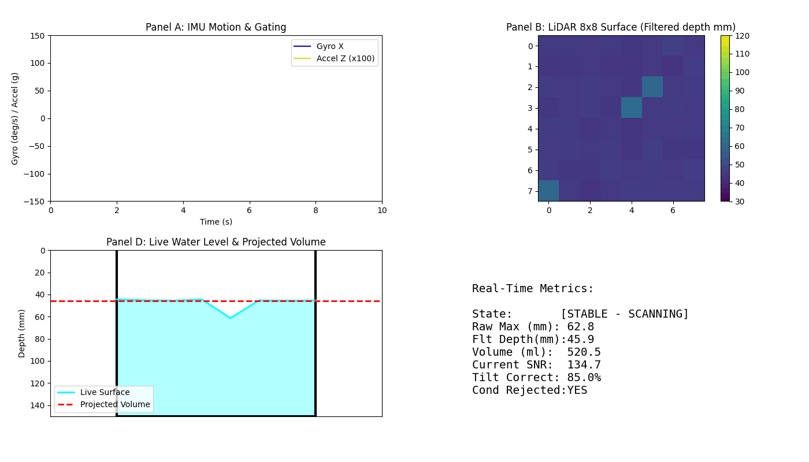

# 🚀 Hydro-Spatial Signal Processing (HSSP) Simulator

A self-contained Python simulation demonstrating a proprietary **6-axis slosh-filtering algorithm** for smart liquid containers. By combining a 6-DOF IMU and a 64-zone dToF LiDAR sensor, this algorithm delivers highly accurate volume estimations even during extreme sloshing or tilting.



## 🧠 Core Algorithmic Innovations

1. **IMU-Gating**: 
   Continuously monitors gyroscope (`deg/s`) and accelerometer (`g`) data to intelligently pause LiDAR scanning during extreme slosh or high-tilt events. This prevents noisy multi-path reflections from corrupting the liquid surface estimation.

2. **Multi-Peak Refractive Rejection**: 
   In realistic container environments, condensation forms near the sensor. By analyzing the raw dToF histograms, the filter discards near-field noise peaks (e.g., droplets within `0-5mm`) and successfully locks onto the true liquid surface return.

3. **Refractive Intensity Correction**: 
   Leveraging IR photon return intensity, the system dynamically distinguishes between reflections originating from an empty metal bottom (high intensity) versus liquid water (lower intensity due to scattering). When water is detected, it scales the light-delay distance properly using water's refractive index (`1.33`).

## 🛠️ Installation & Usage

### Dependencies
Ensure you have the required libraries installed:
```bash
pip install numpy matplotlib pillow
```

### Running the Simulator
To generate the real-time Dashboard animation and test the filtering logic:
```bash
python plotter.py
```
This script will execute the `simulate.py` mock data generator, apply the logic found in `hssp.py`, and output a comprehensive 4-panel mathematical dashboard as `hssp_demo.gif`.
